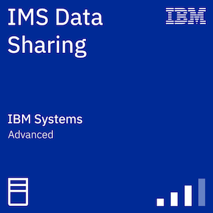
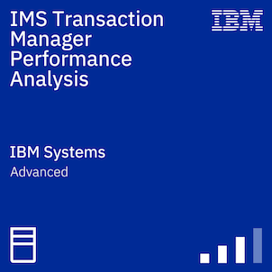
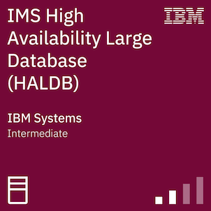
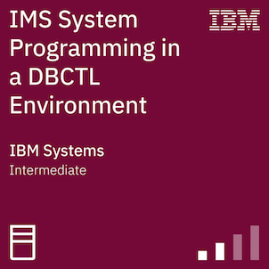
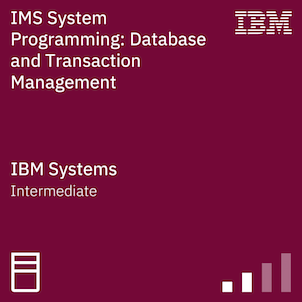

<h2 align="center">rares9301 (ap0)</h1>

why invest a whole 5 minutes manually laboring over a task when you can have the luxury of spending 3-5 business days to automate it?

<h2 align="center"></h2>

<h3 align="center"><i>there must be a way.</i></h3>

<h2>Certifications</h2>

Credits are categorized by their main theme, even if they may encompass multiple topics. For further insight, click on any credit to learn more about its specifics.

<h3>Topic - Systems</h3>
<table>
  <tr>
     <td></td>
     <td></td>
     <td></td>
     <td></td> 
     <td></td>
  </tr>
  <tr>
     <td></td>
     <td></td>
     <td></td>
     <td></td> 
     <td></td>
  </tr>
  <tr>
    <td></td>
    <td></td>
    <td></td>
    <td></td>
  </tr>
</table>

<h3>Topic - Cybersecurity</h3>
<table>
  <tr>
    <td></td>
    <td></td>
    <td></td>
    <td></td>
  </tr>
</table>

<h3>Topic - Networking</h3>
<table>
  <tr>
    <td></td>
    <td></td>
  </tr>
</table>

<h3>Topic - Cloud & Automation</h3>
<table>
  <tr>
    <td></td> 
    <td></td> 
    <td></td> 
  </tr>
</table>

<h1 align="center"> <a href="https://octo-ring.com/register">+</a> <a href="https://octo-ring.com/p/rares9301/prev"><</a>  <a href="https://octo-ring.com/p/rares9301/next">></a> <a href="https://octo-ring.com/p/rares9301/random">!</a>
</h1>

